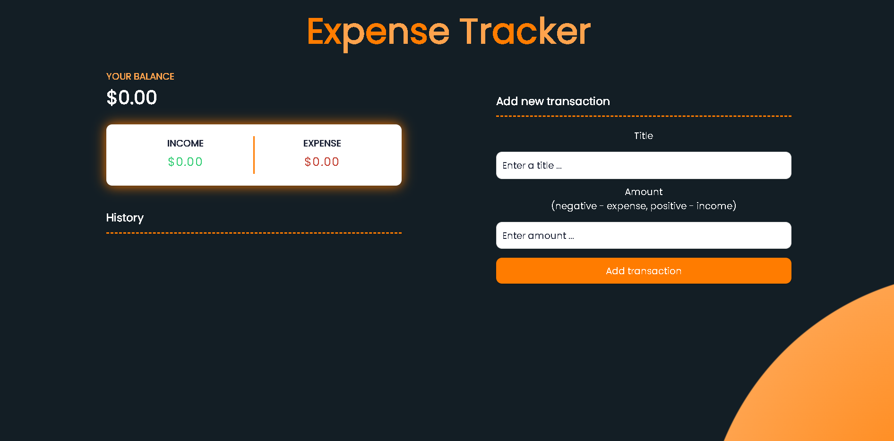
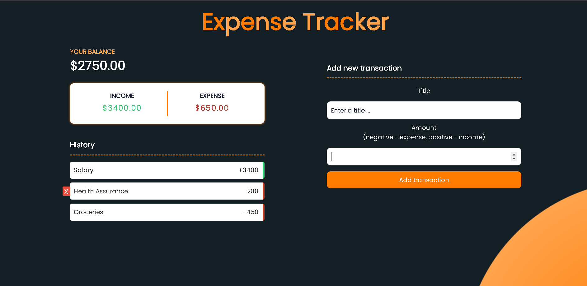

## Welcome To iExpenseTracker :

This is a Fully Responsive Expense Tracker website, that looks amazing in every single screen size, created mainly with Javascript, that you can check now on [iExpense.app](https://iexpensetracker.netlify.app/) <=

## Overview :

## Features :

- You can add/delete transactions to the history, simply by entering the title & the amount in their fields.
- Balance, Income & Expense are automatically calculated after every transaction add or delete.
  -Alerts, in case a field is missing or the transactions history contains a transaction that has the same title as the current transaction.
